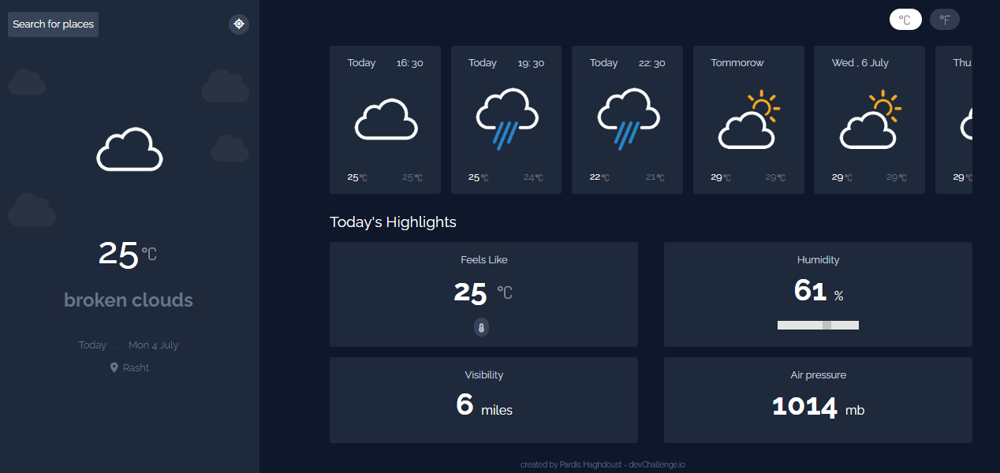

⛅ 𝗪𝗲𝗮𝘁𝗵𝗲𝗿 𝗔𝗽𝗽 using an API
=================================

🔎 About:
-------------------
See weather in your city/state or anywhere in the world.

## 👀 𝗣𝗿𝗲𝘃𝗶𝗲𝘄

## ⚡️ 𝗧𝗲𝗰𝗵𝗻𝗼𝗹𝗼𝗴𝗶𝗲𝘀
* Tailwind Css
* Vanilla Js

## 📡 𝗔𝗣𝗜𝘀 𝘂𝘀𝗲𝗱 𝗶𝗻 𝗮𝗽𝗽𝗹𝗶𝗰𝗮𝘁𝗶𝗼𝗻
* ☀️[OpenWeatherMap](http://www.OpenWeatherMap.org)

## 🔗 Weather Icons
* 🌥️[Weather Underground Icons](https://github.com/manifestinteractive/weather-underground-icons)
